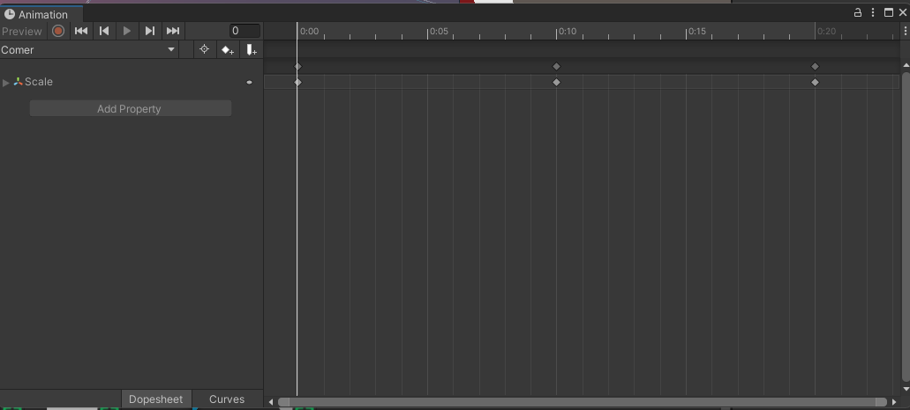

# RollABollPersonalizado

#### En este proyecto tan maravilloso que nos ha propuesto Damían, hemos hecho un Roll a Ball sencillo. Partiendo del proyecto base que nos ha mandado realizar, por mi parte le he realizado varios cambios.

1. En primer lugar, he añadido un `Enemigo` el cual nos persigue todo el rato y en el caso de que nos pille nos caeremos del mapa y no nos dejará seguir jugando. <b>!Todo un reto escapar de él¡</b>


<details><summary>Script Enemigo y Foto Explicativa</summary>

```cs
using UnityEngine;
using UnityEngine.AI;
public class Enemy : MonoBehaviour
{
    private NavMeshAgent pathfinder;
    private Transform target;
    
    void Start()
    {
        pathfinder = GetComponent<NavMeshAgent>();
        target = GameObject.Find("Player").transform;
    }
    void Update()
    {
        pathfinder.SetDestination(target.position);
        Debug.Log(target.position);
    }
}

```
Nuestro enmigo es el cilindro que se encuentra rodeado y la zona en azul es la parte por la cual se puede mover nuestro enemigo.


El NavMeshAgent se utiliza para como comenté anteriormente para que el enemigo pueda moverse por el mapa, en este caso, el enemigo se moverá hacia el jugador.


</details>


2. En segundo lugar, he añadido unos `Obstáculos` que nos los pondrán aun más dificil, para poder conseguir recolectar todas las monedas.  <b>!Ten cuidado¡</b>


3. En tercer lugar, he añadido un sistema de `monedas`, nuestro objetivo será recolectar las 8 monedas que se encuentran por el mapa evitando las adversidades.  <b>¿Serás capaz?</b>


4. Por último, he decido meter una pequeña ayudita para que sea más sencillo el nivel, cada vez que recolectes una `moneda` tu velocidad aumentará en: `0.33`.  <b>!A ver si esto te es de ayuda...¡</b>


<details><summary>animator</summary>


En este caso lo que hace nuestro animator es cambiar el tamaño de la pelota cuando cogemos una moneda (PickUp)

Esta es el Animation que tenemos:



</details>

## Explicamos el código:

### Script PlayerController.cs

#### Aumento de Velocidad

Cuando el jugador entra en contacto con un objeto que tiene la etiqueta "PickUp", se activa el método `OnTriggerEnter(Collider otro)`. Dentro de este método, se realiza lo siguiente:

1. Se verifica si el objeto con el que el jugador ha colisionado tiene la etiqueta "PickUp".
2. Si el objeto tiene la etiqueta "PickUp", se desactiva el objeto para indicar que ha sido recogido.
3. Se incrementa el contador de objetos recogidos.
4. Se incrementa la velocidad del jugador sumando `aumentoDeVelocidad` a la velocidad actual.
5. Se actualiza el texto del contador para reflejar el cambio en el contador de objetos recogidos.
6. Se actualiza el texto de la velocidad para mostrar la velocidad actualizada del jugador.

El incremento de velocidad se logra aumentando el valor de la variable `velocidad` mediante la adición de `aumentoDeVelocidad`. Esto asegura que cada vez que el jugador recoge un objeto "PickUp", su velocidad se aumenta en una cantidad predefinida.

Es importante tener en cuenta que la velocidad inicial del jugador está establecida en 10 unidades, y el valor de `aumentoDeVelocidad` está establecido en 0.33 unidades. Estos valores pueden ajustarse según sea necesario para modificar la mecánica del juego.


### Script RotatorObstaculo.cs

## Rotador de Obstáculos

Este script, `RotatorObstaculo.cs`, está diseñado para rotar un objeto en el eje Y a una velocidad específica. Aquí está cómo funciona:

### Variables:

- `rotateSpeedY`: Esta variable pública determina la velocidad de rotación del objeto en el eje Y. Puedes ajustar este valor en el Inspector de Unity para controlar la velocidad de rotación del objeto.

### Método `Update()`:

El método `Update()` se llama una vez por frame y es donde ocurre la rotación del objeto. Dentro de este método, se realiza lo siguiente:

1. `transform.Rotate()`: Esta función de la clase `Transform` rota el objeto en el espacio según el vector especificado. En este caso, se utiliza `Vector3(0F, rotateSpeedY, 0f)` para rotar el objeto solo en el eje Y a una velocidad determinada.
   
2. `Time.deltaTime`: Esta variable representa el tiempo que ha transcurrido desde el último frame. Multiplicar la velocidad de rotación por `Time.deltaTime` asegura que la rotación sea suave y consistente independientemente de la velocidad de fotogramas del juego. Esto significa que la rotación será igual de rápida independientemente de si el juego se está ejecutando a 30 FPS, 60 FPS o cualquier otra tasa de frames.

Al multiplicar `rotateSpeedY` por `Time.deltaTime`, se asegura que la rotación del objeto sea constante y suave, independientemente de las fluctuaciones en la velocidad de fotogramas del juego.

### Uso:

Para usar este script, simplemente adjunta el script `RotatorObstaculo.cs` a cualquier objeto en tu escena en Unity (En este caso al objeto Obstaculo). Luego, ajusta la variable `rotateSpeedY` en el Inspector para controlar la velocidad de rotación del objeto en el eje Y.


    
